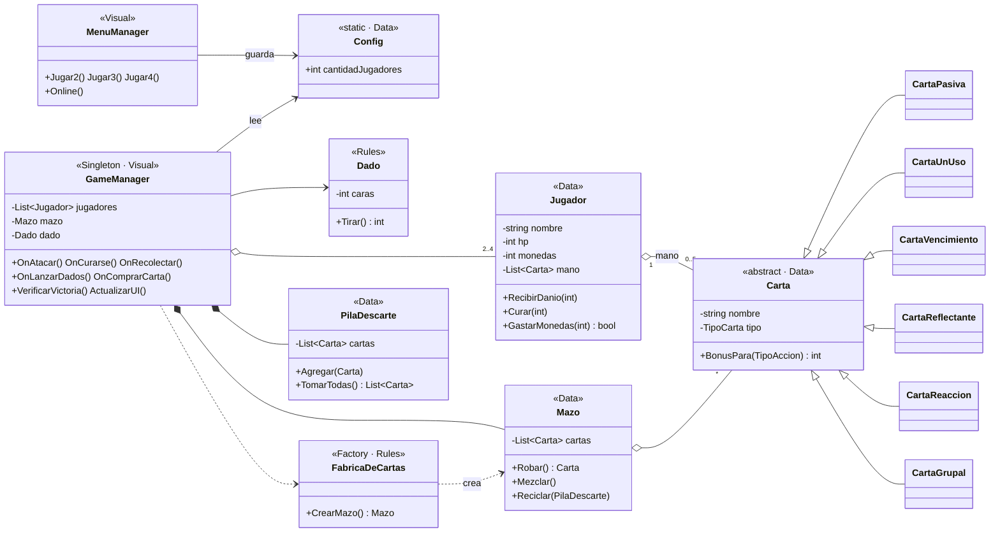
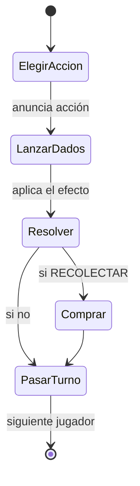
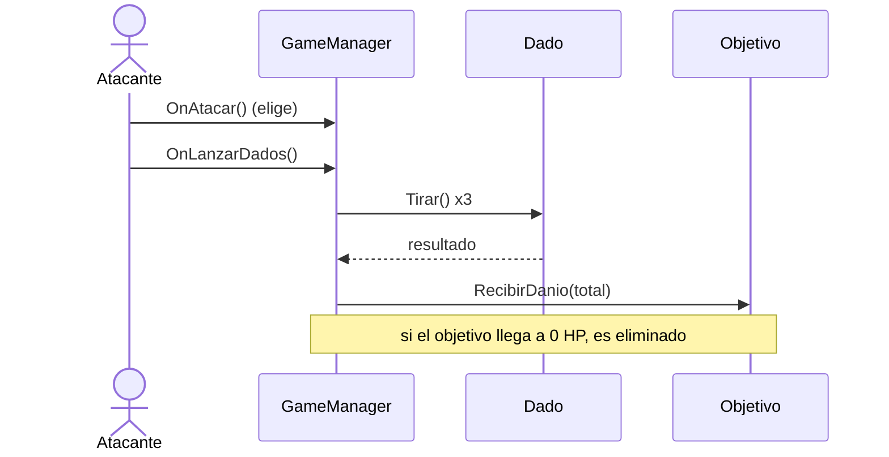
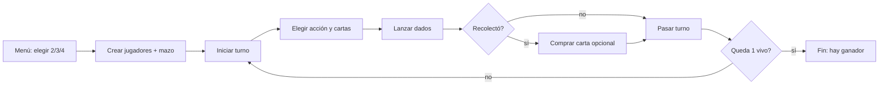

# 🎲 MONATAC — Documentación técnica (UML y flujo)

Diagramas UML y flujo detallado del juego. Están en **Mermaid**, así que GitHub los dibuja automáticamente.
La sintaxis de Unity/C# se movió a un archivo aparte: **[SintaxisUnity.md](SintaxisUnity.md)**.

**Índice**
1. [Qué indica cada tipo de flecha](#-1-qué-indica-cada-tipo-de-flecha)
2. [Diagrama de clases](#-2-diagrama-de-clases)
3. [Máquina de estados del turno](#-3-máquina-de-estados-del-turno)
4. [Secuencia de un ataque](#-4-secuencia-de-un-ataque)
5. [Flujo detallado del juego](#-5-flujo-detallado-del-juego)
6. [Sistema de cartas](#-6-sistema-de-cartas)

---

## 🏹 1. Qué indica cada tipo de flecha

En UML, **la punta de la flecha dice qué tipo de relación hay** entre dos clases:

| Símbolo (Mermaid) | Se dibuja como | Relación | Significa | Ejemplo en MONATAC |
|---|---|---|---|---|
| `<\|--` | línea con **triángulo hueco** ◁ | **Herencia** | "es un tipo de" | `CartaPasiva` **es una** `Carta` |
| `*--` | línea con **rombo relleno** ◆ | **Composición** | "es dueño de; no vive sin él" | `GameManager` **contiene** el `Mazo` |
| `o--` | línea con **rombo hueco** ◇ | **Agregación** | "tiene / agrupa; pueden existir aparte" | `Jugador` **tiene** cartas en la mano |
| `-->` | **flecha simple** → | **Asociación / uso** | "usa a" | `GameManager` **usa** el `Dado` |
| `..>` | flecha **punteada** ⇢ | **Dependencia** | "depende de" | `GameManager` **depende de** `FabricaDeCartas` |
| `<\|..` | triángulo hueco **punteado** | **Realización** | "implementa una interfaz" | una clase **implementa** una interfaz |

**Regla para recordarlo:** triángulo = familia (herencia) · rombo lleno = pertenencia fuerte · rombo hueco = pertenencia débil · flecha simple = una clase usa a otra.

Los números (ej. `"2..4"`) son la **multiplicidad**: `GameManager "1" o-- "2..4" Jugador` = una partida tiene entre 2 y 4 jugadores.

---

## 📦 2. Diagrama de clases

Refleja la **arquitectura actual** del código, agrupada por capas (Data, Rules, Visual).

> **Extensibilidad:** agregar un nuevo tipo de carta es crear una subclase de `Carta` (comodines, Bolsillo Roto, Vampirismo Defensivo…) y sumarla en `FabricaDeCartas`, sin tocar el resto del código.

---

## 🔄 3. Máquina de estados del turno

---

## ➡️ 4. Secuencia de un ataque

---

## 🎯 5. Flujo detallado del juego

Paso a paso, desde que se abre el juego hasta que hay un ganador.

### A. Menú (escena `MENU`)
1. Cargan los botones **2 / 3 / 4 Jugadores** y **Multijugador Online**.
2. Al tocar un número, `MenuManager.Jugar(n)`:
   - Guarda la elección en `Config.cantidadJugadores` (una clase **`static`**, que sobrevive al cambio de escena).
   - Llama `SceneManager.LoadScene("juego")` para cargar la partida.
3. El botón online por ahora solo muestra *"Próximamente"*.

### B. Arranque de la partida (escena `juego`)
1. **`GameManager.Awake()`** (Singleton): fija `Instance` como la única instancia.
2. **`GameManager.Start()`**: lee `Config.cantidadJugadores`, crea esa cantidad de `Jugador`, oculta las barras sobrantes, crea el `Dado`, la `PilaDescarte` y el `Mazo` con **`FabricaDeCartas.CrearMazo()`** (Factory), y llama `IniciarTurno()`.

### C. Inicio de cada turno — `IniciarTurno()`
Reinicia las banderas, elige un **objetivo por defecto**, refresca la UI y avisa *"Turno de Jugador X"*.

### D. El jugador juega su turno
1. **Elegir acción** — `OnAtacar` / `OnCurarse` / `OnRecolectar` guardan `accionElegida` (todavía no resuelven).
2. **Elegir cartas** — `OnUsarCarta(i)` marca/desmarca cartas de la mano (`[USAR]`).
3. **(Si ataca) Cambiar objetivo** — `OnCambiarObjetivo()` rota al siguiente rival vivo.
4. **Lanzar dados** — `OnLanzarDados()`:
   - Calcula, en orden fijo, **dados extra** (`DadosExtraSeleccionados`) → **multiplicador** (`MultiplicadorSeleccionado`) → **bonus** (`BonusSeleccionadas`), todo solo de las cartas elegidas (**polimorfismo**).
   - `total = TirarDados(base + extra) * mult + bonus`.
   - Según la acción: **Atacar** (daño al objetivo, con reacción/reflejo automáticos del defensor), **Curarse** o **Recolectar** (habilita comprar).
   - Descarta las cartas usadas y llama `VerificarVictoria()`.
5. **(Si recolectó) Comprar carta** — `OnComprarCarta()`: con ≥6 monedas y lugar, roba una del `Mazo` (o activa una grupal). Si no compra, **acumula** monedas.
6. **Pasar turno** — `OnPasarTurno()`: avanza al `SiguienteJugadorVivo()` y vuelve a `IniciarTurno()`.

### E. Fin del juego — `VerificarVictoria()`
Cuando queda **un solo jugador vivo**, `juegoTerminado = true` y muestra *"Ganó Jugador X"*.

### Resumen del ciclo

---

## 🃏 6. Sistema de cartas

### Tipos (herencia)
`Carta` (abstracta) → `CartaPasiva`, `CartaUnUso`, `CartaVencimiento`, `CartaReflectante`, `CartaReaccion`, `CartaGrupal` (+ comodines y variantes especiales). Todas comparten `BonusPara(accion)` y cada una lo redefine (**polimorfismo**). El mazo completo tiene las **54 cartas** del reglamento.

### Cómo se usan
| Tipo | Cuándo actúa |
|---|---|
| Pasiva · Un uso · Vencimiento · Comodines | **El jugador las ELIGE** de la mano (clic → `[USAR]`) antes de lanzar los dados |
| Reflectante · Reacción | **Automáticas**: se disparan solas cuando te atacan (Espejo de Sangre, Escudo de Monedas). Son de **un solo uso** (van al descarte) |
| Grupal | **Automática**: se activa **al comprarse** y afecta a todos (no va a la mano) |

### Compra
Al **Recolectar**, con ≥6 monedas y mano con menos de 5 cartas, el botón **Comprar** roba una carta del `Mazo` (patrón **Factory** al armarlo). Si no comprás, las monedas se **acumulan**.

### Resolución (orden fijo)
Sobre las cartas elegidas se aplica: **(1) dados extra** (`Comodín +1d4`) → **(2) multiplicador** (`Comodín ×2`) → **(3) bonus fijo** (pasiva / un uso / vencimiento). En código: `TirarDados(base + extra) * mult + bonus`. Las de un uso y los comodines se marcan con `DebeDescartarse()` y van al **descarte**; si el mazo se agota, se **recicla** (mazo circular).

### Combate defensivo
Al recibir un ataque, `AplicarReaccion()` busca escudos en la mano del defensor (absorben daño gastando monedas) y `AplicarReflejo()` busca reflectantes (devuelven daño / roban monedas / curan). Todas son de **un solo uso**: al dispararse se descartan.

### Cartas de vencimiento (pago por uso)
Tienen **N usos** y se pueden usar **en cualquier momento** (eligiéndolas). El **primer uso es gratis**; del segundo en adelante cuesta **2 monedas** (`CostoDelProximoUso()`). Si el jugador no puede pagar, o la carta se queda **sin usos** (`SinUsos()`), se **descarta**. Todo se resuelve en `BonusSeleccionadas()` al lanzar los dados.

### Cartas grupales (se activan al comprarse)
Al comprar una grupal, su efecto se aplica a **todos** los jugadores y la carta va al **descarte** (no a la mano). Se resuelve en `AplicarGrupal()`:

| Carta | Efecto |
|---|---|
| Colecta | Junta todas las monedas y las reparte parejo; el resto va al comprador |
| Exceso | Cada jugador recibe 1 carta gratis (si tiene lugar) |
| Descarte Grupal | Cada jugador descarta 1 carta |
| Penitencia | Destruye todas las cartas de vencimiento de todas las manos |
| Ley Marcial | El próximo round todos están obligados a Atacar |
